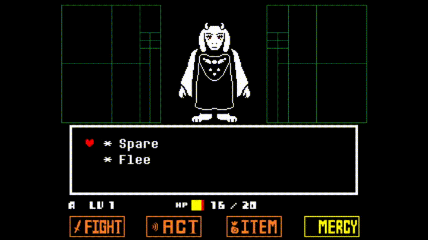

# Page Title, should be used only at the top of the page and should match the page name in the sidebar and the filename

This page demonstrates some markdown formatting and style expectations for the UTSR Guides.

Images should all go in the /images folder. 

</img>

The above line can be used to add an image with alt text and mouseover text. These should generally be the same thing. This should be used for informational images and diagrams.

If the image is just decorative, you can omit the title and alt text fields, like this:

</img>

This alternate markdown method of embedding images is not recommended, as it doesn't always display properly or read the image path properly:


Images may be padded with transparent pixels to a width of 1300 to adjust the "centering" on the page (many images from Google Docs were already this width), or you can do it like this:

<p align="center">
    </img>
</p>

However, it's not required to center every image. Sometimes leaving it left justified works better.

Youtube video embeds can be done like this:

<div style=" max-width: 1280px; aspect-ratio: 16/9; display: flex;">
    <iframe width="100%" height="100%" src="https://www.youtube.com/embed/Ru1MK99uCe4" title="Bad Apple but it&#39;s an Undertale bullet pattern" frameborder="0" allow="accelerometer; autoplay; clipboard-write; encrypted-media; gyroscope; picture-in-picture; web-share" referrerpolicy="strict-origin-when-cross-origin" allowfullscreen></iframe>
</div>

This looks more complicated than it is. The div blocks can be copied from here and the part in between can be generated by going to a Youtube video, right clicking, and clicking "Copy Embed Code". Make sure the video is actually embeddable (a permissions setting on Youtube).

## Page Header, these will appear in the sidebar

### Page sub header, these will also appear in the sidebar

#### Page sub sub header, these or smaller headers will not appear in the sidebar


Extra line breaks are ignored. For consistency, there should be one line break in the middle of a list, quote, or code block. There should be two line breaks after everything else.

- This
- Is
- A
- List
- With
  - Sub bullets

PascalCaseShouldBeUsedForFilesAndFolders

Links can be made like [this](https://www.speedrun.com/ "Alt text for the link"). The alt text is optional but should be used if it's not clear from the text what the link is for.

Inter-guide links can be made like [this](/GeneralGuides/GeneralGuide "Alt text"). Please do not link directly to the deployed pages.

Linking to a specific header can be done like [this](/GeneralGuides/GeneralGuide?id=main-categories "Alt text"). Note that header links don't include punctuation and don't follow the same case rules. Again, please do not link directly to the deployed pages.

> You can also do this
>> And this
>>> And this

`This lets you type in monospaced font, good for referencing game variables inline with normal text.`

```gml
mystr = "Game code can have syntax highlighting like this. Don't forget the gml at the top."
myrand = round(random(100)) + 1
```

*This is italics.*

**This is bold.**

***This is bold and italics.***

You can also make <span style="color:orange">colored text</span> using inline HTML. Use sparingly for things that need to be highlighted, and make sure the colors are readable in both light and dark mode. Also note that <span style="color:red">other markdown styles like **bold** or *italics* might override</span> the color.

## Category guide conventions

The category guides should be geared towards beginners who want to reach intermediate levels. The routes themselves should be intermediate routes, but explained as if to a person who hasn't learned the strats yet. For risk vs. reward tradeoffs, faster, more riskier strats can be presented but should be described as such, with other alternatives recommended. If it's a strat that can be made to be consistent by an intermediate player, it can still be recommended. If it's an RNG strat that loses time a lot of the time, it should not be listed, or if it must be listed, it should be discouraged.

Advanced routes might be written for some categories. If a category has an advanced route. the category page should link to a landing page describing the different guides. An example:

- Neutral
  - Beginner/Intermediate Route
    - This guide is aimed at beginner and intermediate runners and describes how to perform each part of the run.
  - Advanced Route
    - This guide is aimed at top runners and WR contenders. It's an abridged version of the route that only lists the recommended advanced strats that save time.

If a category doesn't have a beginner/intermediate route, this should be written before the advanced route.

Unlike the Undertale General Guide, similar routes should NOT be combined together on the UTSR Guides. However, copying and pasting between guides is fine, as is sharing images and other resources.

In each section of a category guide, you should start of with a 1-sentence description of that section in a quote block.

## Category guide conventions

This is what happens when you reuse a header (check the link to the above header).
